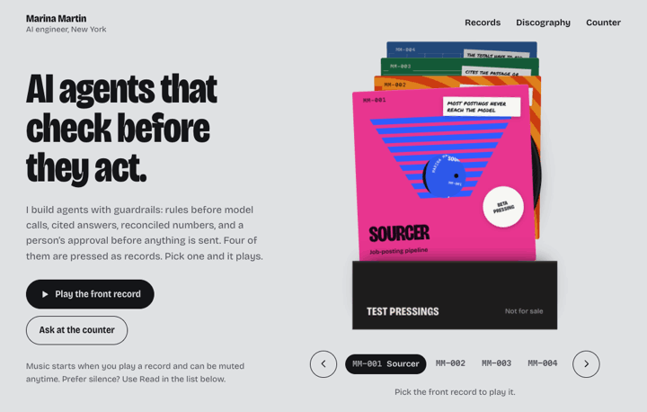

# Marina Martin

Part builder, part data detective. I ask "what if" a lot, then build it to find out. Data is my favorite place to look for answers.

My portfolio is a record shop, so pick a record and let it play.

**[Visit my portfolio](https://marinasofia.github.io/)** · [LinkedIn](https://www.linkedin.com/in/marinasofiaml/)
